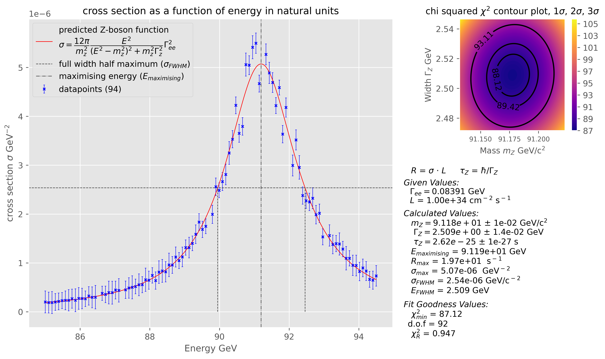

Basic python script for filtering data 
Check the src folder for code and data used. 
Expected output of the code is 

# FILTERING:
This code reads in an arbitrary number of datafiles, filters the data to
exclude non-numerical lines/ elements including nans and infs. the data is then
filtered based on physical motivation(i.e only nonzero uncertainties etc), then
the average around each datapoint is found, if the datapoint is too different
from the average (by default 3 times bigger) it is classed as an outlier. the
function is then fit to the average of the datapoints and the standard
deviations of each datapoint is used to exclude datapoints 3 or more standard
deviations away.

# FITTING:
the code can find an initial guess based on FWHM and maximising ordinate value,
or the code uses the provided initial guess (depends on truth value of AUTO_INITIAL_GUESS)
the validated data is then used to fit the equation and find the minimised
chi squared parameters, the values found are: 
    &emsp;width of z boson  
    &emsp;mass of z boson 
    &emsp;minimised chi squared value 
    &emsp;reduced chi squared 

# CALCULATION:
the minimised plot and values are used to calculate: 
    &emsp;maximum cross section 
    &emsp;maximising energy 
    &emsp;maximum rate of event occurence (instantanous luminosity given) 
    &emsp;lifetime of the Z boson 
    &emsp;the full width half maximum of the curve 

The equation to fit is: 
$$\text{Cross section} = \large \dfrac{12\pi}{m_z^2}\dfrac{E^2}{ (E^2 - m_z^2)^2+(m_zw_z)^2}w_{ee}^2$$ 
    where: 
        &emsp;cross_section = cross section of the interaction in natural units [GeV^-2] 
        &emsp;E = centre of mass energy of in [GeV] 
        &emsp;m = mass of the Z_0 boson in [Gev/c^2] 
        &emsp;w_z =  width of the Z_0 boson in [GeV] 
        &emsp;w_ee = parial width for Z_0 boson -> electron positron decay in [GeV] 
    the equation is in natural units 

The rate of event occuring can be given by: 
    &emsp;R = cross_section * L 
    where: 
        &emsp;R - rate of pair production event in [seconds^-1] 
        &emsp;L - instantanous luminosity of colliding beams in [area^-1 second^-1] 
with values for m and w_z, a lifetime of Z_0 boson can be calculated by: 
    &emsp;t_w = h_bar^2/w_z 
    where: 
        &emsp;t_w - lifetime of Z_0 boson in seconds 
the data is plotted against the calculated model, and a contour plot showing
the chi squared as a function of parameter space is made.
provided a beam luminosity the rate R a peak reaction rate is calculated using
the highest value of cross section according to the function: 
    &emsp;R = cross_section * beam luminsoity
